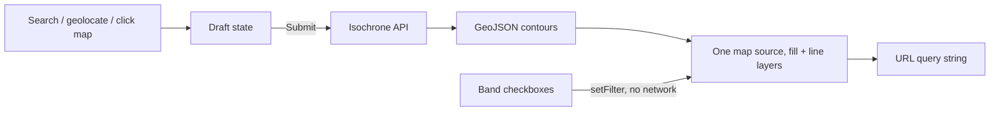

# isochrones

See how far you can get. Pick a starting point and a mode of transport, and the
map shades the area reachable within a set of travel times.

Built on the [Mapbox Isochrone API](https://docs.mapbox.com/api/navigation/isochrone/).

## Quick start

```bash
npm install
cp .env.example .env.local   # then add your token, see below
npm run dev
```

The app runs at http://localhost:5173.

## Getting a Mapbox token

You need a free Mapbox account.

1. Go to https://account.mapbox.com/access-tokens/
2. Create a token, or copy the **default public token**.
3. Put it in `.env.local`:

   ```
   VITE_MAPBOX_TOKEN=pk.your_token_here
   ```

The token needs these scopes, all of which the default public token already
has: `styles:read`, `fonts:read`, `navigation:read` (the Isochrone API) and
`geocoding:read` (address search).

> [!IMPORTANT]
> Use a **public** token — one starting with `pk.`. A secret token (`sk.`)
> pasted here would be compiled into the JavaScript bundle and published to
> every visitor. The app checks the prefix on startup and refuses to run with a
> secret token rather than leaking it quietly.

`.env.local` is gitignored. Do not commit it.

### Before you deploy

A public token in a client bundle is normal and unavoidable — mapbox-gl needs
it in the browser — but an unrestricted one can be lifted and billed to you.

Add a **URL restriction** to the token before the app is publicly reachable:
on the token's page, under *URL restrictions*, add your deployed origin (for
example `https://isochrones.example.com/*`). Mapbox will then reject requests
carrying that token from anywhere else.

Keep a second, unrestricted token for local development, or add
`http://localhost:5173/*` to the restriction list.

## Commands

| Command | What it does |
| --- | --- |
| `npm run dev` | Dev server with hot reload |
| `npm run build` | Production build into `dist/` |
| `npm run preview` | Serve the production build locally |
| `npm run typecheck` | `tsc --noEmit` |
| `npm test` | Unit tests (Vitest) |

## How it works

No backend. The browser talks to Mapbox directly.



A few decisions worth knowing about if you are changing this code:

- **Nothing is fetched until you submit.** State is split into a draft (what
  the form holds) and a submitted query (what the map shows), so choosing a
  location and a mode together costs one request rather than two.
- **Band visibility is not part of that split.** Showing and hiding a band
  filters data already in the browser, so it is instant and costs no API quota.
- **Band visibility is tracked by row position, not by minute value.** That is
  what lets a hidden band survive switching profile, which rewrites every
  number in the list.
- **A shareable link is the whole view.** Origin, label, profile, travel times
  and which bands are visible all live in the query string, and opening one
  renders immediately.

## API limits worth knowing

These are Mapbox's, not ours, and the UI enforces them:

- At most **4 contours** per request.
- At most **60 minutes** per contour.
- 300 requests per minute.

One trap, if you are extending the API client: an unroutable origin returns
**HTTP 200** with no `features` key at all, plus a `code` field such as
`NoSegment`. Checking `response.ok` alone renders a blank map. See
[`src/api/isochrone.ts`](src/api/isochrone.ts).

## Licensing

The Mapbox terms require isochrone results to be **displayed on a Mapbox map**
using a Mapbox SDK. Swapping mapbox-gl for MapLibre or Leaflet while continuing
to call the Isochrone API would breach that.

## Project layout

```
src/
  api/        Isochrone + geocoding clients, with their tests
  components/ Panel UI
  map/        mapbox-gl lifecycle, layers, camera
  state/      Query orchestration, URL state, band validation
  styles/
```

## Accessibility

Keyboard reachable throughout, with visible focus rings. Travel-time bands are
distinguished by a number and a checkbox as well as by colour. Status messages
announce via a live region. Camera animations are skipped when the system asks
for reduced motion.
