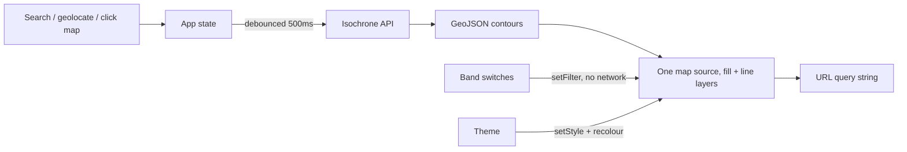

# isochrones

See how far you can get. Pick a starting point and a mode of transport, and the
map shades the area reachable within a set of travel times.

Built on the [Mapbox Isochrone API](https://docs.mapbox.com/api/navigation/isochrone/).

## Quick start

```bash
npm install
cp .env.example .env.local   # then add your token, see below
npm run dev
```

The app runs at http://localhost:5173.

## Getting a Mapbox token

You need a free Mapbox account.

1. Go to https://account.mapbox.com/access-tokens/
2. Create a token, or copy the **default public token**.
3. Put it in `.env.local`:

   ```
   VITE_MAPBOX_TOKEN=pk.your_token_here
   ```

The token needs these scopes, all of which the default public token already
has: `styles:read`, `fonts:read`, `navigation:read` (the Isochrone API) and
`geocoding:read` (address search).

> [!IMPORTANT]
> Use a **public** token — one starting with `pk.`. A secret token (`sk.`)
> pasted here would be compiled into the JavaScript bundle and published to
> every visitor. The app checks the prefix on startup and refuses to run with a
> secret token rather than leaking it quietly.

`.env.local` is gitignored. Do not commit it.

### Before you deploy

A public token in a client bundle is normal and unavoidable — mapbox-gl needs
it in the browser — but an unrestricted one can be lifted and billed to you.

Add a **URL restriction** to the token before the app is publicly reachable:
on the token's page, under *URL restrictions*, add your deployed origin (for
example `https://isochrones.example.com/*`). Mapbox will then reject requests
carrying that token from anywhere else.

Keep a second, unrestricted token for local development, or add
`http://localhost:5173/*` to the restriction list.

## Commands

| Command | What it does |
| --- | --- |
| `npm run dev` | Dev server with hot reload |
| `npm run build` | Production build into `dist/` |
| `npm run preview` | Serve the production build locally |
| `npm run typecheck` | `tsc --noEmit` |
| `npm test` | Unit tests (Vitest) |

## How it works

No backend. The browser talks to Mapbox directly.



A few decisions worth knowing about if you are changing this code:

- **The map follows the form.** There is no submit button; a change to the
  origin, the profile or a travel time refetches. Typed minute values are
  debounced by 500ms so a three-digit number is one request, not three.
- **Fetch by validity, display by validity and on.** Every row holding a valid
  number is requested, whether its switch is on or off, so flicking a switch
  never waits on the network. A typo in a switched-off row cannot block the
  other three.
- **Band visibility is tracked by row position, not by minute value.** That is
  what lets a switched-off band survive changing profile, which rewrites every
  number in the list.
- **A shareable link is the whole view.** Origin, label, profile, travel times
  and which bands are visible all live in the query string, and opening one
  renders immediately. The theme is deliberately left out — it belongs to
  whoever is looking, not to the view being shared.
- **A theme change rebuilds the map's style from scratch**, destroying every
  source and layer on it. `styleEpoch` in
  [`src/map/useMapboxMap.ts`](src/map/useMapboxMap.ts) exists so the render
  effects rebuild afterwards; without it the contours would vanish on a theme
  switch, because none of their own inputs changed.

## Theming

Light and dark, following the system by default. The toggle in the panel
header cycles system → light → dark, and anything other than system is stored
in `localStorage`. While it is on system, the app tracks the OS setting live.

An inline script in [`index.html`](index.html) applies the stored choice
before first paint, so a dark-mode user never gets a white flash. It
necessarily repeats the rules in [`src/state/theme.ts`](src/state/theme.ts) —
change one and change the other.

Each theme has its own basemap (`light-v11` / `dark-v11`) and its own band
colour ramp. The ramps are not inversions of each other: on light, the nearest
band is the deepest colour, and on dark it is the palest. What carries over is
the rule, which is that the nearest band should have the most contrast against
the map beneath it.

## API limits worth knowing

These are Mapbox's, not ours, and the UI enforces them:

- At most **4 contours** per request.
- At most **60 minutes** per contour.
- 300 requests per minute.

One trap, if you are extending the API client: an unroutable origin returns
**HTTP 200** with no `features` key at all, plus a `code` field such as
`NoSegment`. Checking `response.ok` alone renders a blank map. See
[`src/api/isochrone.ts`](src/api/isochrone.ts).

## Licensing

The Mapbox terms require isochrone results to be **displayed on a Mapbox map**
using a Mapbox SDK. Swapping mapbox-gl for MapLibre or Leaflet while continuing
to call the Isochrone API would breach that.

## Project layout

```
src/
  api/        Isochrone + geocoding clients, with their tests
  components/ Panel UI
  map/        mapbox-gl lifecycle, layers, camera
  state/      Query orchestration, URL state, band validation, theme
  styles/
```

## Accessibility

Keyboard reachable throughout, with visible focus rings. Travel-time bands are
distinguished by a number and a switch as well as by colour. Status messages
announce via a live region. Camera animations are skipped when the system asks
for reduced motion, and the colour scheme follows the system unless told
otherwise.
