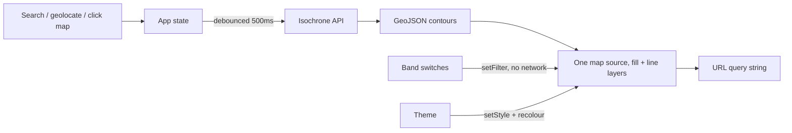

# isochrones

See how far you can get. Pick a starting point and a mode of transport, and the
map shades the area reachable within a set of travel times.

Built on the [Mapbox Isochrone API](https://docs.mapbox.com/api/navigation/isochrone/).

## Quick start

```bash
npm install
cp .env.example .env.local   # then add your token, see below
npm run dev
```

The app runs at http://localhost:5173.

## Getting a Mapbox token

You need a free Mapbox account.

1. Go to https://account.mapbox.com/access-tokens/
2. Create a token, or copy the **default public token**.
3. Put it in `.env.local`:

   ```
   VITE_MAPBOX_TOKEN=pk.your_token_here
   ```

The token needs these scopes, all of which the default public token already
has: `styles:read`, `fonts:read`, `navigation:read` (the Isochrone API) and
`geocoding:read` (address search).

> [!IMPORTANT]
> Use a **public** token — one starting with `pk.`. A secret token (`sk.`)
> pasted here would be compiled into the JavaScript bundle and published to
> every visitor. The app checks the prefix on startup and refuses to run with a
> secret token rather than leaking it quietly.

`.env.local` is gitignored. Do not commit it.

### Before you deploy

A public token in a client bundle is normal and unavoidable — mapbox-gl needs
it in the browser — but an unrestricted one can be lifted and billed to you.

Add a **URL restriction** to the token before the app is publicly reachable:
on the token's page, under *URL restrictions*, add your deployed origin (for
example `https://isochrones.example.com/*`). Mapbox will then reject requests
carrying that token from anywhere else.

Keep a second, unrestricted token for local development, or add
`http://localhost:5173/*` to the restriction list.

## Commands

| Command | What it does |
| --- | --- |
| `npm run dev` | Dev server with hot reload |
| `npm run build` | Production build into `dist/` |
| `npm run preview` | Serve the production build locally |
| `npm run typecheck` | `tsc --noEmit` |
| `npm test` | Unit tests (Vitest) |

## How it works

No backend. The browser talks to Mapbox directly.



A few decisions worth knowing about if you are changing this code:

- **The map follows the form.** There is no submit button; a change to the
  origin, the profile or a travel time refetches. Typed minute values are
  debounced by 500ms so a three-digit number is one request, not three.
- **Fetch by validity, display by validity and on.** Every row holding a valid
  number is requested, whether its switch is on or off, so flicking a switch
  never waits on the network. A typo in a switched-off row cannot block the
  other three.
- **Band visibility is tracked by row position, not by minute value.** That is
  what lets a switched-off band survive changing profile, which rewrites every
  number in the list.
- **A shareable link is the whole view.** Origin, label, profile, travel times
  and which bands are visible all live in the query string, and opening one
  renders immediately. The theme is deliberately left out — it belongs to
  whoever is looking, not to the view being shared.
- **A theme change rebuilds the map's style from scratch**, destroying every
  source and layer on it. `styleEpoch` in
  [`src/map/useMapboxMap.ts`](src/map/useMapboxMap.ts) exists so the render
  effects rebuild afterwards; without it the contours would vanish on a theme
  switch, because none of their own inputs changed.

## Choosing a starting point

There are three ways to set one — type an address, press the pin to use your
own location, or click the map — and one control says so: a search field with
the pin joined to its right edge, placeholder "Search, or click the map".

The origin is named **once**, on a label beside the pin on the map. The panel
used to repeat it in a row underneath the field, which said the same thing
twice and cost 72px of a 667px-tall phone.

Three things about that label are easy to get wrong:

- **It is not attached with `Marker.setPopup()`.** That helper puts
  `role="button"` on the marker and binds click-to-toggle, which turns a
  passive pin into a control sitting in the middle of a map where a click is
  supposed to mean "put the origin here". The `Popup` is created and moved
  alongside the `Marker` instead, in
  [`src/map/useOriginMarker.ts`](src/map/useOriginMarker.ts).
- **`pointer-events: none` has to land on `.mapboxgl-popup-content`.** Mapbox's
  stylesheet already sets it on `.mapboxgl-popup` and then sets `auto` back on
  the content, so styling the root looks right and does nothing — leaving a
  dead patch of map over the current origin that swallows clicks.
- **`closeOnClick` must be off.** A map click sets a *new* origin, so the
  default would close the label on the very gesture that should move it.
  `focusAfterOpen` must be off too, or every reverse geocode yanks focus out of
  the search field.

The placeholder is short for a measured reason. Google's full phrasing,
"Choose a starting point, or click the map", renders at 293px, and the field is
217px wide on an iPhone SE once the pin is carved out of it. The long version
is kept as the input's accessible name, where width does not apply.

That accessible name takes a `MutationObserver`.
`<mapbox-search-box>` copies its placeholder into the input's `aria-label` and
exposes no prop to override it, and it rewrites the attribute on its own
schedule — so the observer has to stay connected rather than fire once.

## Theming

Light and dark, following the system by default. The toggle in the panel
header cycles system → light → dark, and anything other than system is stored
in `localStorage`. While it is on system, the app tracks the OS setting live.

An inline script in [`index.html`](index.html) applies the stored choice
before first paint, so a dark-mode user never gets a white flash. It
necessarily repeats the rules in [`src/state/theme.ts`](src/state/theme.ts) —
change one and change the other.

Each theme has its own basemap (`light-v11` / `dark-v11`) and its own band
colour ramp. The ramps are not inversions of each other: on light, the nearest
band is the deepest colour, and on dark it is the palest. What carries over is
the rule, which is that the nearest band should have the most contrast against
the map beneath it.

The search field is the one thing the theme object cannot colour. `colorText`
in `SEARCH_THEME` reaches the suggestion list but not the input, which keeps
the component's built-in light defaults — on dark, text at 1.48:1 and a
placeholder at 2.87:1. Both are set from CSS instead. If you touch that rule,
keep the `:focus` selector: the component styles the input twice, and the
focus rule is the more specific of the two, so dropping it leaves the text
unreadable in exactly the state you type in.

## Small screens

Below 640px the panel becomes a sheet pinned to the top of the viewport. It is
laid out to fit an iPhone SE (375×667) without scrolling: the travel modes are
a single row of icon-and-label buttons and the four bands are a 2×2 grid.

Choosing a starting point collapses the sheet to its header and search field,
and so does tapping anywhere outside it. That second gesture is fiddlier than
it looks. The tap lands on the map, and the map's own click handler reads a
click as "put the origin here" — so without care one tap would both close the
sheet and move the pin somewhere nobody chose.

It is handled by ignoring map clicks for `DISMISS_CLICK_MS` after a dismissal
(see [`src/config.ts`](src/config.ts)) rather than by calling `preventDefault`
on the pointer event, which would also kill the ability to start a pan outside
the panel. A time window rather than a one-shot flag, because a tap that turns
into a drag produces no click at all, and a flag would then eat the next
genuine tap.

The pin button rides along in that sticky region, so all three ways of setting
an origin stay reachable with the sheet shut. The geolocation error message
lives there too, for the same reason: it is raised by a button that can be
pressed while collapsed, and an error rendered in the hidden part of the panel
would fail silently.

## API limits worth knowing

These are Mapbox's, not ours, and the UI enforces them:

- At most **4 contours** per request.
- At most **60 minutes** per contour.
- 300 requests per minute.

One trap, if you are extending the API client: an unroutable origin returns
**HTTP 200** with no `features` key at all, plus a `code` field such as
`NoSegment`. Checking `response.ok` alone renders a blank map. See
[`src/api/isochrone.ts`](src/api/isochrone.ts).

## Licensing

The Mapbox terms require isochrone results to be **displayed on a Mapbox map**
using a Mapbox SDK. Swapping mapbox-gl for MapLibre or Leaflet while continuing
to call the Isochrone API would breach that.

## Project layout

```
src/
  api/        Isochrone + geocoding clients, with their tests
  components/ Panel UI
  map/        mapbox-gl lifecycle, layers, camera
  state/      Query orchestration, URL state, band validation, theme
  styles/
```

## Accessibility

Keyboard reachable throughout, with visible focus rings. Travel-time bands are
distinguished by a number and a switch as well as by colour. Status messages
announce via a live region. Camera animations are skipped when the system asks
for reduced motion, and the colour scheme follows the system unless told
otherwise.
